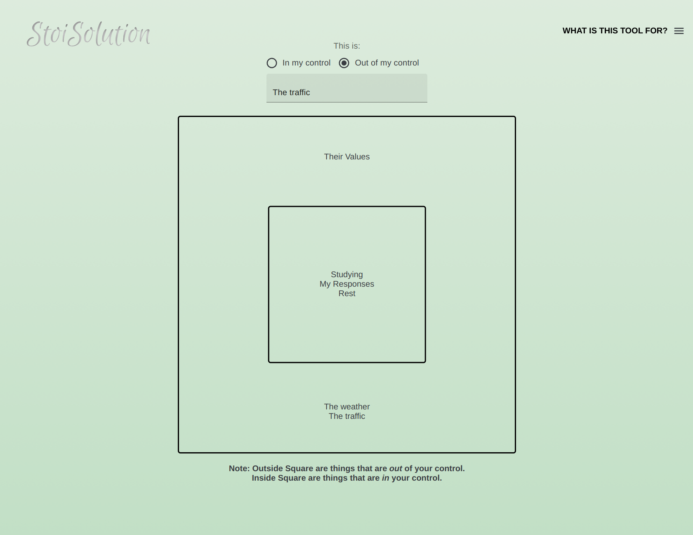

##

## Table of Contents
- [Table of Contents](#table-of-contents)
- [General info](#general-info)
- [Technologies](#technologies)
- [Learning](#learning)

## General info 
This project was created to help digitalize the exercise of recognizing what parts of a stressor in your life are within and outside of your control. This helps relieve stress and improves your efficiency by allowing you to direct your attention to the things that matter.

## Technologies
This Project was created with:
* REACT
* CSS
* JavaScript
* [MUI](https://mui.com/) Library

## Learning
This project was good exercise to solidify my knowledge of developing a React App from start to finish including deployment. I also got the opportunity to learn some more about the ways to access DOM elements. It was a fun challenge deciding how to display the text inside of each box in a way that made sense and looked good.
